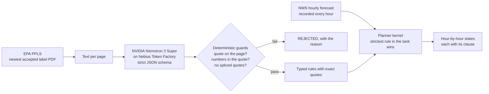

# Labelhand

[](https://github.com/StephenSook/labelhand/actions/workflows/ci.yml)


**Every label in the tank, checked against the forecast, one hour at a time.**

A cotton grower defoliating in Georgia sprays a tank mix of two or three products. Each product's EPA label sets its own wind limit, rain-free period, inversion rule, buffers and release height, and federal law makes using a pesticide in a manner inconsistent with its labeling unlawful (FIFRA, 7 U.S.C. 136j(a)(2)(G)). The applicator is supposed to hold all of those labels in their head and match them against the weather.

Labelhand reads the full EPA label of every product in the tank and turns each restriction into a rule that quotes the exact label sentence it came from. It then checks those rules against the National Weather Service hourly forecast for the field and marks every hour in one of three states:

| State | Meaning |
|---|---|
| **FORECAST-PERMITTED** | Every rule of every product in the tank is satisfied by the forecast for that hour. |
| **BLOCKED** | At least one rule is violated. The hour shows which product, which page and the exact clause. |
| **FIELD CHECK** | The forecast cannot decide (temperature inversions, borderline rain chances). The applicator checks on site. |

It never says a spray is legal. The applicator stays in charge.

> Built for the **Nebius x NVIDIA Global AI Hackathon** (Best Apps & Agents). Work in progress: the label compiler and planner kernel run today; the web app, phone call, application record and mobile apps are being built.

## How it works



1. **Fetch.** `tools/ppls_fetch.py` reads EPA's Pesticide Product Label System for each registration number, downloads the newest accepted label, checks it is really a PDF, and records its accepted date and SHA-256. A changed hash means the label changed and must be recompiled.
2. **Compile.** `compiler/compile_label.py` sends each page to **`nvidia/nemotron-3-super-120b-a12b` on Nebius Token Factory** with a strict JSON schema (guided decoding), so every rule comes back typed: parameter, operator, value, unit, modality (MUST, MUST_NOT, ADVISORY) and the verbatim quote.
3. **Guard.** Code, not the model, decides what survives. The quote must appear on that page exactly (ignoring only where the PDF extractor put spaces), quotes may not be spliced with "...", and every number in a rule must appear in its own quote. Unit conversions are done in code, never by the model.
4. **Plan.** `engine/windows.py` evaluates every product's rules against each forecast hour. A rule only drives the planner if its quote names its own topic (a wind rule must mention wind), which stops a mislabeled rule from deciding anything.
5. **Record.** `tools/nws_recorder.py` saves the NWS forecast and nearest station observation for ten Georgia cotton-county points every hour, because NWS keeps no forecast archive and every result must be replayable.

## Measured so far

Three real Georgia cotton defoliation labels: Folex 6 EC (EPA Reg. 5481-504, accepted 2026-03-04), Dropp SC (264-700) and Prep (264-418), 32 pages in total.

**Accuracy against a gold set.** [`eval/gold_v0.json`](eval/gold_v0.json) holds 46 clauses the planner relies on (wind, inversion, rain, temperature, open-boll stage, buffers, release height, droplets, re-entry), annotated from the label text and checked against it by `eval/verify_gold.py`. It is our own annotation until an outside reviewer checks it. `eval/score.py` scores every configuration; each row below changed one thing and was kept or reverted on the numbers.

| Configuration | Coverage | Typed recall | Value exact | Modality | Acting precision | Acting recall |
|---|---|---|---|---|---|---|
| Nemotron 3 Super, one pass | 0.652 | 0.565 | 0.941 | 0.654 | 0.824 | 0.900 |
| + Nemotron 3 Ultra typing pass | 0.652 | 0.609 | 0.947 | 0.964 | 0.909 | 0.900 |
| + Ultra second extraction pass (union) | 0.891 | 0.848 | 0.931 | 0.897 | 0.800 | 1.000 |
| + typing v2 (stricter definitions) | 0.891 | 0.848 | 0.897 | 0.872 | 1.000 | **0.800** |
| + typing v3 (types the constraint the first reading named) | 0.891 | 0.891 | 0.935 | **0.902** | **1.000** | **1.000** |
| + unit restore in code, extraction prompt p2 (one rule per constraint or alternative) | **0.957** | **0.957** | **0.941** | 0.841 | **1.000** | **1.000** |

*Acting* rules are the ones the planner can turn into BLOCKED or FIELD CHECK. Acting recall is the safety number: a missed wind or rain limit would mark a forbidden hour as permitted. Typing v2 raised precision but dropped a wind limit hidden in a sentence that also set a boom height, so v3 replaced it.

The planner still uses the typing v3 row. The p2 row finds three more gold clauses (the two Folex re-entry intervals and Dropp's one-half mile lettuce buffer), none of which the hourly planner acts on, and its acting numbers are the same, but its modality accuracy is lower (0.841 against 0.902). Token Factory cost for the p2 pipeline on three labels: $0.53 (Super pass $0.033, Ultra pass $0.18, typing $0.31).

**Run-to-run variance.** One run is one draw, so the p2 pipeline was run three times with the same prompts at temperature 0:

| p2 run | Coverage | Value exact | Modality | Acting precision | Acting recall |
|---|---|---|---|---|---|
| 1 | 0.957 | 0.941 | 0.841 | 1.000 (11/11) | 1.000 (10/10) |
| 2 | 0.957 | 0.971 | 0.886 | 1.000 (11/11) | 1.000 (10/10) |
| 3 | 0.957 | 0.941 | 0.864 | 1.000 (10/10) | **0.900 (9/10)** |

Coverage held, but run 3 missed an acting clause. Folex's "When minimum night temperature is below 60F use FOLEX 6 EC alone" reached the typing pass with the same quote and summary in every run, and Nemotron 3 Ultra typed it MUST in run 1 and ADVISORY in runs 2 and 3. Run 2 kept recall only because a second, longer quote of the same sentence was typed MUST. Identical requests at temperature 0 do not always return the same modality, so a single typing pass is not enough for the safety number.

**Tried and rejected: three typing votes.** Typing every rule three times and keeping it acting if any vote said MUST (`compiler/retype.py --votes 3`) cost about three times as much ($0.93 to $0.99 per run against $0.32) and changed nothing that matters: acting recall stayed 1.0, 1.0, 0.9, because in run 3 all three votes typed the Folex clause ADVISORY. Value exact fell on two of the three runs. Results are in `eval/results/p2*_union_typed_v3k3.json`. The option stays in the code with a default of one vote.

What the guards caught, in a real run:
- The Folex label sets two restricted-entry intervals: **7 days** at rates at or below 0.75 lb ai/A and **10 days** above that rate. The model spliced the sentence with "..." into a single 10-day rule and dropped the rate condition. Rejected, because a spliced quote is not what the label says.
- The model converted 3 feet to 36 inches and one-half mile to 2,640 feet. Conversions belong in code, so `restore_units` now maps such a value back to the number and unit in the quote when it can reproduce the conversion exactly, and records what it undid. Anything it cannot reproduce is still rejected by the number guard.

Known limits we are working on, with details in [`SPIKE-01-label-compile.md`](SPIKE-01-label-compile.md): the p2 row still misses two gold clauses, both Dropp SC night-temperature clauses in the poor text layer of its scanned 2009 label (OCR is the planned fix); one font in the 2026 Folex PDF has no Unicode map for the "1/2" glyph; and passes vary between runs (table above), which is why two extraction passes are unioned.

All four NVIDIA Nemotron models on Token Factory (3.5 Lightning, 3 Nano 30B, 3 Super 120B, 3 Ultra 550B) passed our capability probe for strict JSON schema output and tool calling, with time to first token between 0.44 and 0.78 s.

## Run it

Requires Python 3.12 and [uv](https://docs.astral.sh/uv/).

```bash
uv venv --python 3.12
uv pip install -r pyproject.toml --extra dev
cp .env.example .env                                      # add NEBIUS_API_KEY from tokenfactory.nebius.com
python tools/ppls_fetch.py 5481-504 264-700 264-418      # downloads the labels from EPA
python compiler/compile_label.py 5481-504 264-700 264-418
python tools/nws_recorder.py                              # records the current forecast
python engine/windows.py --point tift --hours 48
```

Tests run offline with no key:

```bash
pytest -q
```

## Data sources
- **EPA Pesticide Product Label System (PPLS)** for label PDFs. Labels are downloaded from EPA at run time and are not redistributed here; compiled rules keep short quoted clauses with page numbers and a link to the source PDF.
- **National Weather Service API** (`api.weather.gov`) for hourly forecasts and station observations.

## License
Apache-2.0. Not legal or agronomic advice: the label is the law, and the applicator decides.
