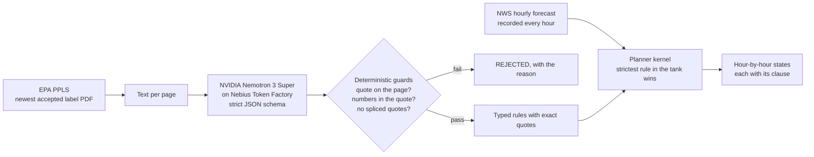

# Labelhand

[](https://github.com/StephenSook/labelhand/actions/workflows/ci.yml)


**Every label in the tank, checked against the forecast, one hour at a time.**

A cotton grower defoliating in Georgia sprays a tank mix of two or three products. Each product's EPA label sets its own wind limit, rain-free period, inversion rule, buffers and release height, and federal law makes using a pesticide in a manner inconsistent with its labeling unlawful (FIFRA, 7 U.S.C. 136j(a)(2)(G)). The applicator is supposed to hold all of those labels in their head and match them against the weather.

Labelhand reads the full EPA label of every product in the tank and turns each restriction into a rule that quotes the exact label sentence it came from. It then checks those rules against the National Weather Service hourly forecast for the field and marks every hour in one of three states:

| State | Meaning |
|---|---|
| **FORECAST-PERMITTED** | Every rule of every product in the tank is satisfied by the forecast for that hour. |
| **BLOCKED** | At least one rule is violated. The hour shows which product, which page and the exact clause. |
| **FIELD CHECK** | The forecast cannot decide (temperature inversions, borderline rain chances). The applicator checks on site. |

It never says a spray is legal. The applicator stays in charge.

> Built for the **Nebius x NVIDIA Global AI Hackathon** (Best Apps & Agents). Work in progress: the label compiler and planner kernel run today; the web app, phone call, application record and mobile apps are being built.

## How it works



1. **Fetch.** `tools/ppls_fetch.py` reads EPA's Pesticide Product Label System for each registration number, downloads the newest accepted label, checks it is really a PDF, and records its accepted date and SHA-256. A changed hash means the label changed and must be recompiled.
2. **Compile.** `compiler/compile_label.py` sends each page to **`nvidia/nemotron-3-super-120b-a12b` on Nebius Token Factory** with a strict JSON schema (guided decoding), so every rule comes back typed: parameter, operator, value, unit, modality (MUST, MUST_NOT, ADVISORY) and the verbatim quote.
3. **Guard.** Code, not the model, decides what survives. The quote must appear on that page exactly (ignoring only where the PDF extractor put spaces), quotes may not be spliced with "...", and every number in a rule must appear in its own quote. Unit conversions are done in code, never by the model.
4. **Plan.** `engine/windows.py` evaluates every product's rules against each forecast hour. A rule only drives the planner if its quote names its own topic (a wind rule must mention wind), which stops a mislabeled rule from deciding anything.
5. **Record.** `tools/nws_recorder.py` saves the NWS forecast and nearest station observation for ten Georgia cotton-county points every hour, because NWS keeps no forecast archive and every result must be replayable.

## Measured so far

Three real Georgia cotton defoliation labels: Folex 6 EC (EPA Reg. 5481-504, accepted 2026-03-04), Dropp SC (264-700) and Prep (264-418), 32 pages in total.

| | Result |
|---|---|
| Rules accepted | 120 |
| Rules rejected by the guards | 18 |
| Token Factory cost, all three labels | $0.028 |
| Time per label (pages in parallel) | about 10 s |

What the guards caught, in a real run:
- The model spliced two clauses and stated the Folex restricted-entry interval as **10 days**. The label says **7 days**. Rejected.
- The model converted 3 feet to 36 inches and one-half mile to 2,640 feet. Rejected: conversions belong in code.

Known limits we are working on, with numbers in [`SPIKE-01-label-compile.md`](SPIKE-01-label-compile.md): coverage varies between runs, some rules get the wrong parameter type, one font in the 2026 Folex PDF has no Unicode map for the "1/2" glyph, and the 2009 Dropp SC label is a scan with a poor text layer.

All four NVIDIA Nemotron models on Token Factory (3.5 Lightning, 3 Nano 30B, 3 Super 120B, 3 Ultra 550B) passed our capability probe for strict JSON schema output and tool calling, with time to first token between 0.44 and 0.78 s.

## Run it

Requires Python 3.12 and [uv](https://docs.astral.sh/uv/).

```bash
uv venv --python 3.12
uv pip install -r pyproject.toml --extra dev
cp .env.example .env                                      # add NEBIUS_API_KEY from tokenfactory.nebius.com
python tools/ppls_fetch.py 5481-504 264-700 264-418      # downloads the labels from EPA
python compiler/compile_label.py 5481-504 264-700 264-418
python tools/nws_recorder.py                              # records the current forecast
python engine/windows.py --point tift --hours 48
```

Tests run offline with no key:

```bash
pytest -q
```

## Data sources
- **EPA Pesticide Product Label System (PPLS)** for label PDFs. Labels are downloaded from EPA at run time and are not redistributed here; compiled rules keep short quoted clauses with page numbers and a link to the source PDF.
- **National Weather Service API** (`api.weather.gov`) for hourly forecasts and station observations.

## License
Apache-2.0. Not legal or agronomic advice: the label is the law, and the applicator decides.
