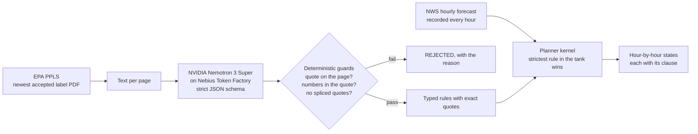

# Labelhand

[](https://github.com/StephenSook/labelhand/actions/workflows/ci.yml)


**Every label in the tank, checked against the forecast, one hour at a time.**

A cotton grower defoliating in Georgia sprays a tank mix of two or three products. Each product's EPA label sets its own wind limit, rain-free period, inversion rule, buffers and release height, and federal law makes using a pesticide in a manner inconsistent with its labeling unlawful (FIFRA, 7 U.S.C. 136j(a)(2)(G)). The applicator is supposed to hold all of those labels in their head and match them against the weather.

Labelhand reads the full EPA label of every product in the tank and turns each restriction into a rule that quotes the exact label sentence it came from. It then checks those rules against the National Weather Service hourly forecast for the field and marks every hour in one of three states:

| State | Meaning |
|---|---|
| **FORECAST-PERMITTED** | Every rule of every product in the tank is satisfied by the forecast for that hour. |
| **BLOCKED** | At least one rule is violated. The hour shows which product, which page and the exact clause. |
| **FIELD CHECK** | The forecast cannot decide (temperature inversions, borderline rain chances). The applicator checks on site. |

It never says a spray is legal. The applicator stays in charge.

> Built for the **Nebius x NVIDIA Global AI Hackathon** (Best Apps & Agents). Work in progress: the label compiler, planner kernel, web app, source-label viewer and browser-generated application record run today. The phone call and mobile apps are being built.

## How it works



1. **Fetch.** `tools/ppls_fetch.py` reads EPA's Pesticide Product Label System for each registration number, downloads the newest accepted label, checks it is really a PDF, and records its accepted date and SHA-256. A changed hash means the label changed and must be recompiled.
2. **Compile.** `compiler/compile_label.py` sends each page to **`nvidia/nemotron-3-super-120b-a12b` on Nebius Token Factory** with a strict JSON schema (guided decoding), so every rule comes back typed: parameter, operator, value, unit, modality (MUST, MUST_NOT, ADVISORY) and the verbatim quote.
3. **Guard.** Code, not the model, decides what survives. The quote must appear on that page exactly (ignoring only where the PDF extractor put spaces), quotes may not be spliced with "...", and every number in a rule must appear in its own quote. Unit conversions are done in code, never by the model.
4. **Plan.** `engine/windows.py` evaluates every product's rules against each forecast hour. A rule only drives the planner if its quote names its own topic (a wind rule must mention wind), which stops a mislabeled rule from deciding anything.
5. **Record.** `tools/nws_recorder.py` saves the NWS forecast and nearest station observation for ten Georgia cotton-county points every hour, because NWS keeps no forecast archive and every result must be replayable.

### Rust core

`core/` is the shared planner kernel for browser WASM and later UniFFI phone bindings. It reproduces the Python kernel exactly on the three frozen Georgia fixtures, covering 3 x 156 forecast hours.

```bash
cargo fmt --check
cargo clippy --all-targets --all-features -- -D warnings
cargo test
wasm-pack build core --target web --release -- --features wasm
```

## Measured so far

Three real Georgia cotton defoliation labels: Folex 6 EC (EPA Reg. 5481-504, accepted 2026-03-04), Dropp SC (264-700) and Prep (264-418), 32 pages in total.

**Accuracy against a gold set.** [`eval/gold_v0.json`](eval/gold_v0.json) holds 46 clauses the planner relies on (wind, inversion, rain, temperature, open-boll stage, buffers, release height, droplets, re-entry), annotated from the label text and checked against it by `eval/verify_gold.py`. It is our own annotation until an outside reviewer checks it. `eval/score.py` scores every configuration; each row below changed one thing and was kept or reverted on the numbers.

| Configuration | Coverage | Typed recall | Value exact | Modality | Acting precision | Acting recall |
|---|---|---|---|---|---|---|
| Nemotron 3 Super, one pass | 0.652 | 0.565 | 0.941 | 0.654 | 0.588 | 0.900 |
| + Nemotron 3 Ultra typing pass | 0.652 | 0.609 | 0.947 | 0.964 | 0.909 | 0.900 |
| + Ultra second extraction pass (union) | 0.891 | 0.848 | 0.931 | 0.897 | 0.458 | 1.000 |
| + typing v2 (stricter definitions) | 0.891 | 0.848 | 0.897 | 0.872 | 1.000 | **0.800** |
| + typing v3 (types the constraint the first reading named) | 0.891 | 0.891 | 0.935 | **0.902** | **1.000** | **1.000** |
| + unit restore in code, extraction prompt p2 (one rule per constraint or alternative) | **0.957** | **0.957** | **0.941** | 0.841 | **0.909 (10/11)** | **1.000** |
| **Shipped majority `.ship` merge of three p2 + typing v3 + OCR + modality-floor runs** | **1.000** | **1.000** | 0.944 | 0.870 | **1.000 (12/12)** | **1.000 (10/10)** |

*Acting* rules are the ones the planner can turn into BLOCKED or FIELD CHECK. Acting recall is the safety number: a missed wind or rain limit would mark a forbidden hour as permitted. Typing v2 raised precision but dropped a wind limit hidden in a sentence that also set a boom height, so v3 replaced it.

**Scorer correction, 2026-10-05.** Acting precision now requires an acting rule to match a gold clause whose modality is also MUST or MUST_NOT. Previously, Folex rule `5481-504-p10-5` was counted as correct because its temperature parameter and quote matched gold clause F-TEMP-60, even though gold marks that clause ADVISORY. In the numbers shown here, Super moved from 0.824 to 0.588, raw union from 0.800 to 0.458, p2 run 1 and its modality-floor and OCR variants from 1.000 to 0.909 (10/11), and the acting-wins `.ship` merge from 1.000 (13/13) to 0.923 (12/13). Planner precision is unchanged.

The planner ships the majority `.ship` row. Each duplicate clause gets one modality vote per run; two matching votes win, a clause found in only one run keeps that modality, and a three-way split keeps the first acting modality. The fixed decision rule selected this merge because coverage recall, strict acting precision, and acting recall are all 1.0. Every source modality and vote count stays in the compiled rule. [`eval/results/ship.json`](eval/results/ship.json) is the committed score receipt. The p2 pipeline's Token Factory cost on three labels was $0.53 per run (Super pass $0.033, Ultra pass $0.18, typing $0.31).

### Tank-composition clauses

The Folex clause &quot;When minimum night temperature is below 60°F use FOLEX 6 EC alone&quot; controls what may be in the tank. It is not a general temperature limit. The Python reference kernel and Rust port now recognize a MUST or MUST_NOT temperature clause matching `\buse\b[^.]*\balone\b`. When the temperature condition holds, a mixed tank is BLOCKED with the other products named; the named product by itself satisfies the clause. When the condition does not hold, the clause does not change the verdict.

The committed Tift replay has 156 hours and a recorded night minimum of 61°F, so this condition never holds there. The earlier `.union.typed.v3` rules and the majority `.ship` set therefore produce the same measured totals:

| Tift tank | `.union.typed.v3` | Majority `.ship` |
|---|---|---|
| Folex + Dropp + Prep | 17 permitted, 63 field check, 76 blocked | 17 permitted, 63 field check, 76 blocked |
| Folex alone | 31 permitted, 54 field check, 71 blocked | 31 permitted, 54 field check, 71 blocked |
| Dropp + Prep | 17 permitted, 63 field check, 76 blocked | 17 permitted, 63 field check, 76 blocked |

The cold-condition unit case uses a 56°F night low. It blocks Folex in a mixed tank, permits the same hour when Folex is the only product, and does nothing for a warm night. The results view also exposes real in-browser what-ifs: on the Tift replay, removing Prep produces 31 forecast-permitted hours in five windows of 6, 6, 11, 5 and 3 hours.

**Run-to-run variance.** One run is one draw, so the p2 pipeline was run three times with the same prompts at temperature 0:

| p2 run | Coverage | Value exact | Modality | Acting precision | Acting recall |
|---|---|---|---|---|---|
| 1 | 0.957 | 0.941 | 0.841 | 0.909 (10/11) | 1.000 (10/10) |
| 2 | 0.957 | 0.971 | 0.886 | 1.000 (11/11) | 1.000 (10/10) |
| 3 | 0.957 | 0.941 | 0.864 | 1.000 (10/10) | **0.900 (9/10)** |

Coverage held, but run 3 missed an acting clause. Folex's "When minimum night temperature is below 60F use FOLEX 6 EC alone" reached the typing pass with the same quote and summary in every run, and Nemotron 3 Ultra typed it MUST in run 1 and ADVISORY in runs 2 and 3. Run 2 kept recall only because a second, longer quote of the same sentence was typed MUST. Identical requests at temperature 0 do not always return the same modality, so a single typing pass is not enough for the safety number.

**Tried and rejected: three typing votes.** Typing every rule three times and keeping it acting if any vote said MUST (`compiler/retype.py --votes 3`) cost about three times as much ($0.93 to $0.99 per run against $0.32) and changed nothing that matters: acting recall stayed 1.0, 1.0, 0.9, because in run 3 all three votes typed the Folex clause ADVISORY. Value exact fell on two of the three runs. Results are in `eval/results/p2*_union_typed_v3k3.json`. The option stays in the code with a default of one vote.

**Kept: EPA's own rule, in code.** EPA's PR Notice 2000-5 says mandatory label statements "are generally written in imperative or directive terms (such as "shall," "must," "do this," "do not")", and that a heading sets a statement's intent. `compiler/modality.py` applies that after typing, with no model call: an ADVISORY rule on a weather parameter the planner acts on is raised to MUST or MUST_NOT when its sentence is a prohibition, or a directive that gates the application itself ("use FOLEX 6 EC alone", "apply only when"), has no suggestive term (should, may, recommend), and does not sit in the label's SPRAY DRIFT ADVISORIES section. It never lowers a modality and keeps the model's answer next to its own. "Applicators must use 1/2 swath displacement" is mandatory but is a technique, not a weather limit, so it is left alone. Across the three runs it raised exactly one rule, the Folex night-temperature clause, in runs 2 and 3, where the model had typed it ADVISORY; in run 1 the model had already typed it MUST, so nothing was raised. No other rule changed:

| p2 run, with the modality floor | Coverage | Value exact | Modality | Acting precision | Acting recall |
|---|---|---|---|---|---|
| 1 | 0.957 | 0.941 | 0.841 | 0.909 (10/11) | 1.000 (10/10) |
| 2 | 0.957 | 0.971 | 0.886 | 1.000 (12/12) | 1.000 (10/10) |
| 3 | 0.957 | 0.941 | 0.886 | 1.000 (11/11) | **1.000 (10/10)** |

Command: `python compiler/modality.py 5481-504 264-700 264-418 --suffix .union.p2.typed.v3 --tag .mf`, then `python eval/score.py --suffix .union.p2.typed.v3.mf`. Results: `eval/results/p2*_union_typed_v3mf.json`.

**Kept: a second reading of the page.** The last two misses were not extraction failures. Both passes quoted Dropp SC's two night-temperature sentences correctly in every run, and the guard rejected them, because the label is a 2009 scan whose text layer reads `less"ti'liln desirable` where the page says "less than desirable". `tools/ocr_job/` reads every page again with **NVIDIA Nemotron Parse 2.0 on a Nebius AI Cloud L40S Serverless Job** (9 pages, 2.0 to 9.7 s per page). OCR makes its own mistakes (it read "regrowth" as "growth" in that same sentence), so neither reading is trusted alone. `compiler/two_readings.py` accepts a rejected quote only if it appears exactly in the OCR text of its page, or if it matches one reading everywhere except short spans that the other reading confirms verbatim, with 8 characters of context on each side. Spliced quotes stay rejected, the number guard runs again, and each rescued rule is typed by the same Ultra typing pass. "Less desirable" (a model variant missing "than") is still rejected. Rescue cost: under one cent per run.

| p2 run, modality floor + second reading | Coverage | Typed recall | Value exact | Modality | Acting precision | Acting recall |
|---|---|---|---|---|---|---|
| 1 | **1.000 (46/46)** | **1.000** | 0.944 | 0.848 | 0.909 (10/11) | 1.000 (10/10) |
| 2 | **1.000 (46/46)** | **1.000** | 0.972 | 0.891 | 1.000 (12/12) | 1.000 (10/10) |
| 3 | **1.000 (46/46)** | **1.000** | 0.944 | 0.891 | 1.000 (11/11) | 1.000 (10/10) |

Commands: `python compiler/two_readings.py 5481-504 264-700 264-418 --suffix .union.p2.typed.v3`, then the modality floor with `--suffix .union.p2.typed.v3.ocr`, then `python eval/score.py --suffix .union.p2.typed.v3.ocr.mf`. Results: `eval/results/p2*_union_typed_v3_ocr_mf.json`. The OCR text itself is label text, so like the label PDFs it is regenerated by the job and never committed.

What the guards caught, in a real run:
- The Folex label sets two restricted-entry intervals: **7 days** at rates at or below 0.75 lb ai/A and **10 days** above that rate. The model spliced the sentence with "..." into a single 10-day rule and dropped the rate condition. Rejected, because a spliced quote is not what the label says.
- The model converted 3 feet to 36 inches and one-half mile to 2,640 feet. Conversions belong in code, so `restore_units` now maps such a value back to the number and unit in the quote when it can reproduce the conversion exactly, and records what it undid. Anything it cannot reproduce is still rejected by the number guard.

Known limits we are working on, with details in [`SPIKE-01-label-compile.md`](SPIKE-01-label-compile.md): the gold set is 46 clauses on three labels and is our own annotation; one font in the 2026 Folex PDF has no Unicode map for the "1/2" glyph; passes vary between runs (tables above), which is why two extraction passes are unioned; and value exact and modality accuracy are below 1.0, which matters less for the planner because acting recall is 1.0 on every run and the shipped majority merge scores 1.0 on acting precision (12/12). Single runs reach 0.909 to 1.0 on acting precision (tables above).

All four NVIDIA Nemotron models on Token Factory (3.5 Lightning, 3 Nano 30B, 3 Super 120B, 3 Ultra 550B) passed our capability probe for strict JSON schema output and tool calling, with time to first token between 0.44 and 0.78 s.

## Run it

Requires Python 3.12 and [uv](https://docs.astral.sh/uv/).

```bash
uv venv --python 3.12
uv pip install -r pyproject.toml --extra dev
cp .env.example .env                                      # add NEBIUS_API_KEY from tokenfactory.nebius.com
python tools/ppls_fetch.py 5481-504 264-700 264-418      # downloads the labels from EPA
python compiler/compile_label.py 5481-504 264-700 264-418
python tools/nws_recorder.py                              # records the current forecast
python engine/windows.py --point tift --hours 48
```

Tests run offline with no key:

```bash
pytest -q
```

## Data sources
- **EPA Pesticide Product Label System (PPLS)** for label PDFs. Labels are downloaded from EPA at run time and are not redistributed here; compiled rules keep short quoted clauses with page numbers and a link to the source PDF.
- **National Weather Service API** (`api.weather.gov`) for hourly forecasts and station observations.

### Spray record source and status

The spray record uses the last effective text of 7 CFR 110.3 as a former federal checklist. USDA removed 7 CFR part 110 effective July 11, 2025, so Labelhand does not present the former 14-day deadline as a current federal requirement. The source record is the [July 10, 2025 eCFR XML](https://www.ecfr.gov/api/versioner/v1/full/2025-07-10/title-7.xml?part=110), and the rescission is [90 FR 20083](https://www.govinfo.gov/content/pkg/FR-2025-05-12/pdf/FR-2025-05-12.pdf).

The former section required these elements exactly:

> (1) The brand or product name, and the EPA registration number of the restricted use pesticide that was applied;
>
> (2) The total amount of the restricted use pesticide applied;
>
> (3) The location of the application, the size of area treated, and the crop, commodity, stored product, or site to which a restricted use pesticide was applied.
>
> (4) The month, day, and year on which the restricted use pesticide application occurred; and
>
> (5) The name and certification number (if applicable) of the certified applicator who applied or who supervised the application of the restricted use pesticide.

Former 7 CFR 110.3(c) stated: "The information required in this section shall be recorded within 14 days following the pesticide application."

The generated PDF includes those former checklist fields plus blank actual start and end times and wind measured at the boom. Users must follow current state and other applicable recordkeeping requirements. A pypdf reading of all 32 pages in the three accepted PDFs found no `RESTRICTED USE PESTICIDE` phrase in Folex 6 EC, Dropp SC, or Prep.

## License
Apache-2.0. Not legal or agronomic advice: the label is the law, and the applicator decides.
